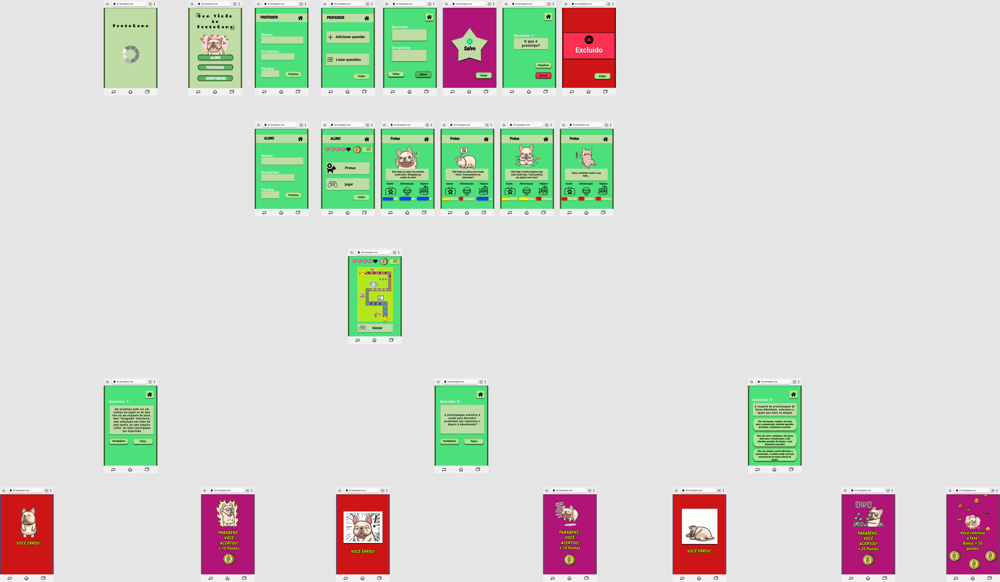
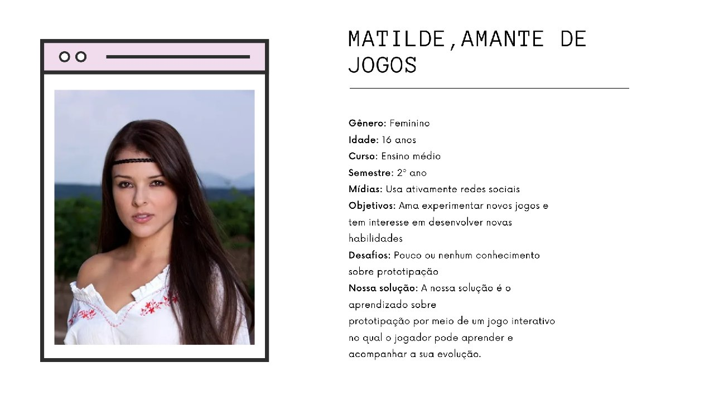

# Avaliação do Protótipo de Alta Fidelidade do ProtoGame

Data       | Versão | Descrição                               | Autor(es)
 --------- | ------ | --------------------------------------- | -------------------------------------------------
14/11/2020 | 0.0    | Criação do documento                    |[Iolane Andrade](https://github.com/IolaneAndrade)
15/11/2020 | 0.1    | Gravação da avaliação                   |[Iolane Andrade](https://github.com/IolaneAndrade)
15/11/2020 | 0.2    | análise da avaliação                    |[Iolane Andrade](https://github.com/IolaneAndrade)
16/11/2020 | 0.3    | Imagem do protótipo de alta fidelidade  |[Iolane Andrade](https://github.com/IolaneAndrade)
16/11/2020 | 0.4    | Relato e avaliação do protótipo de alta fidelidade pela Persona Pedro  |[Gabriela](https://github.com/gag2502)
01/12/2020 | 0.5 | Revisão do documento | Stéfane Souza

## Protótipo de Alta Fidelidade

A figura 1 ilustra a primeira parte do prototipo de alta fidelidade do projeto ProtoGame. Contendo fluxo do aluno ao responder uma questão e o fluxo do professor ao criar turma e adicionar questões. 

[Figura 1: Prototipo de Alta Fidelidade - Parte 1](./img/Avaliacao-relato-resultados-proto-alta-fidelidade/ProtoGame-parte1.png)

## Preparação

Ao realizar uma avaliação, proceda da seguinte maneira:

- Siga as instruções definidas na avaliação;
- Comece a avaliação com uma apresentação; 
- Busque falar em voz alta todos os passos que você está seguindo durante a gravação da avaliação;
- Responda as questões definidas no documento do planejamento da avaliação;

# Avaliação 1

### Participante:
 

#### Figura 2 - Persona 1

### Objetivos da Avaliação:

A participante, Matilde deverá seguir as instruções definidas nas duas tabelas abaixo. Tendo como objetivo 1 "Iniciar um jogo e responder questões corretamente." e objetivo 2 "Iniciar um jogo e responder alguma questão incorretamente."

 

Item                    | Descrição
----------------------- | ---------------------------
**Objetivo 1:**         | Iniciar um jogo e responder questões corretamente.
**Ator:**               | Aluno.
**Pré-condição:**       | O Aluno já está cadastrado no sistema.
**Procedimentos:**      | 1. Entrar no jogo ProtoGame e selecionar a opção "Aluno";
                        | 2. Selecionar a opção "Próximo";
                        | 3. Selecionar a opção "Jogar";
                        | 4. Selecionar a opção "Iniciar";
                        | 5. Responder a primeira questão como "verdadeira";
                        | 6. Responder a segunda questão como "falsa";
                        | 7. Responda a terceira questão selecionando a primeira opção;
**Resultado esperado:** | É esperado que o aluno acerte todas as questões e passe de fase.

#### Tabela 1 - Avaliação da Persona 1: Objetivo 1

Item                    | Descrição
----------------------- | ---------------------------
**Objetivo 2:**         | Iniciar um jogo e responder alguma questão incorretamente.
**Ator:**               | Aluno.
**Pré-condição:**       | O Aluno já está cadastrado no sistema.
**Procedimentos:**      | 1. Entrar no jogo ProtoGame e selecionar a opção "Aluno";
                        | 2. Selecionar a opção "Próximo";
                        | 3. Selecionar a opção "Jogar";
                        | 4. Selecionar a opção "Iniciar";
                        | 5. Responder a primeira questão como "verdadeira";
                        | 6. Responder a segunda questão como "verdadeira";
**Resultado esperado:** | É esperado que o aluno erre a segunda questão e tenha que reiniciar o jogo.

#### Tabela 1 - Avaliação da Persona 1: Objetivo 2

### Protótipo Utilizado na Avaliação

Para esta avaliação foi utilizada esta primeira parte do protótipo de alta fidelidade. Nesta fase, o protótipo engloba apenas o fluxo do aluno descrito nos casos de teste.

 <iframe style="border: 1px solid rgba(0, 0, 0, 0.1);" width="800" height="450" src="https://www.figma.com/embed?embed_host=share&url=https%3A%2F%2Fwww.figma.com%2Fproto%2FviUeY0Pov7Thoh0ZC19Eh1%2FProtoGame-FluxoAluno-IniciarJogo-responderquest%25C3%25A3o%3Fscaling%3Dscale-down%26node-id%3D61%253A85" allowfullscreen></iframe>

## Coleta de dados

A coleta de dados ocorreu por meio da aplicação e gravação da avaliação heurística, feita com a participante Matilde.

Para acessar a gravação da avaliação 1 >>[clique aqui.](https://www.youtube.com/embed/LeNjNtP9bVY)<<

## Consolidação e relato dos resultados

A avaliação com a Matilde gerou bons resultados. Para uma versão inicial do protótipo, demonstrou está coerente com a ideia do produto. A participante disse: "Parece ser coerente com o estudo de prototipação e o design parece bem simples entender então eu acredito que está adequado." A organização das atividades também estão simplificadas e claras. A participante disse: "Sim para mim estava bem claro. [...] Se eu errar eu sou levada para o início do jogo, se eu acerto eu consigo prosseguir. Então está bem claro". As atividades também foram avaliadas como intuitivas e as informações simples de compreender . A participante disse: " Sim. É bem intuitivo, porque são poucas funcionalidades. É um protótipo bem simples então acaba que a gente não tem muito aonde se perder no jogo. [...] "Sim. São bem simples como eu falei, são poucas atividades no jogo então a gente não tem como se perder muito". No geral, a ideia do produto foi considerada agradável. A participante disse: "A ideia do produto é agradável sim. Eu gostei bastante da ideia. Questões simples e aí vai dificultando o nível. [...]  eu gostei da ideia do produto".

 
No geral a avaliação do protótipo, na atividade do aluno responder uma questão, atendeu as expectativas iniciais da equipe. Atividades simples, claras, coerentes e agradavel.

# Avaliação 2  

### Participante:

[Figura 3: Descrição da Persona 4](./img/personas/persona-4.png)

### Objetivos da Avaliação:

 O participante, Pedro deverá seguir as instruções definidas nas duas tabelas abaixo. Tendo como objetivo adicionar novas questões na aplicação e gerenciá-las.

Item                    | Descrição
----------------------- | ---------------------------
**Objetivo 1:**         | Criar uma turma e incluir questões
**Ator:**               | Professor
**Pré-condição:**       | Nenhuma
**Procedimentos:**      | 1. Entrar no jogo ProtoGame selecionar a opção "Professor"
                        | 2. Fazer seu cadastro como professor  
                        | 3. Criar questão  
                        | 4. Listar questões  
                        | 5. Alterar uma questão  
                        | 6. Excluir uma questão
**Resultado esperado:** | É esperado que o professor consiga gerenciar suas questões

#### Tabela 3 - Avaliação da Persona 4: Objetivo 1

## Coleta de dados  

A coleta de dados ocorreu por meio da aplicação e gravação do teste de usabilidade com a utilização do software Cool Scren Recorder, feita com o participante Pedro. 

Para acessar a gravação da avaliação 2 >>[clique aqui.](https://www.youtube.com/embed/N9F5ZYSmbU0)<<

## Consolidação e relato dos resultados  

A avaliação com o Pedro gerou bons resultados, assim como a com a Matilde. O participante gostou da aplicação e não demonstrou dificuldades ao navegar afim de realizar suas tarefas. Além disso, avaliou como sendo útil para seus objetivos. Sugeriu que a aplicação permitisse o professor adicionar tempo para responder cada pergunta, porque assim poderia usar o jogo para aplicar mini testes da disciplina.

 
A avaliação do protótipo do ponto de vista do professor também obteve resultados positivos.

