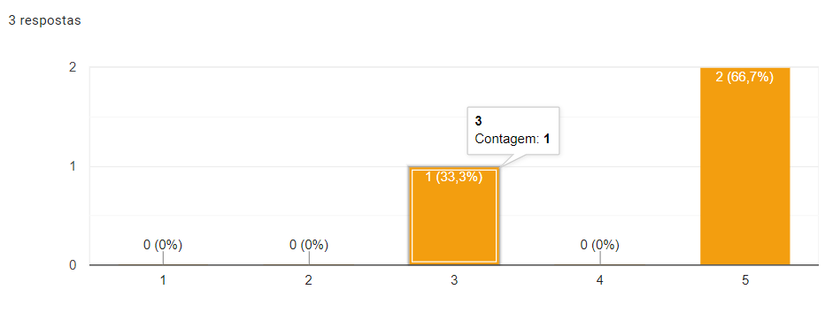
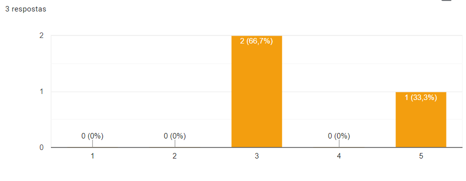
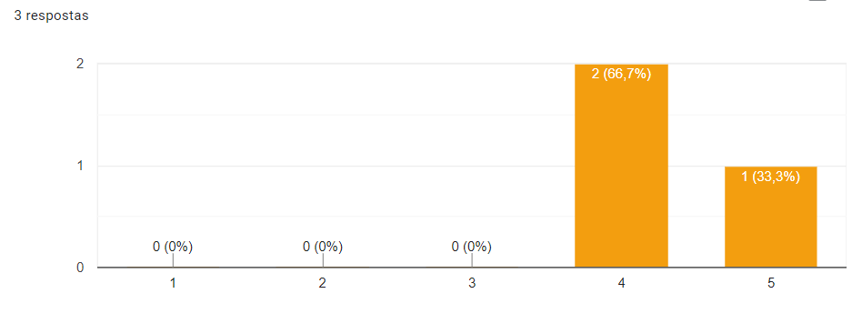
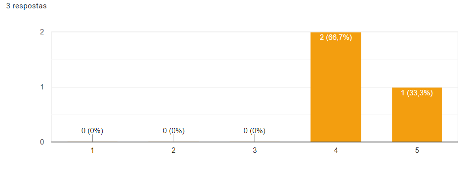
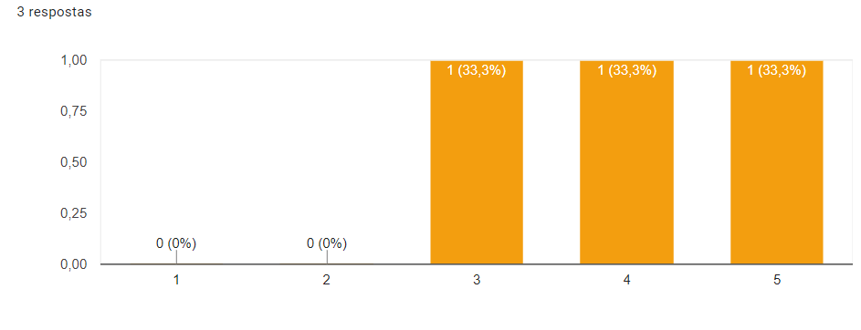

# Avaliação do Storyboard

### Perfil dos participantes

| Nome  | Idade  | Escolaridade   | Ocupação profissional |
|---|---|---|---|
| João | 22 | Ensino Superior Incompleto  | Estudante |
| Alice | 18 | Ensino Superior Incompleto  | Estudante |
| Victor Hugo | 25 | Ensino Superior Incompleto  | Estudante |

### Análise
Foram feitas 7 perguntas aos participantes:

- As atividades estão adequadas para faixa etária?

- As atividades proporcionam o desenvolvimento de competências gerais pelo aluno/utilizador, sugeridas no currículo?

- As atividades permitem um envolvimento ativo do professor?

- A organização e apresentação da informação está simples de compreender?

- A ideia do produto é agradável?

- O personagem Protus (bichinho de estimação) transmite uma ideia/sentimento positivo?

- Possui alguma consideração a respeito da avaliação?

Os participantes da avaliação enquadram-se no perfil definido pelas Personas elaboradas.
O participante mais velho tem 25 anos e o mais jovem possue 18 anos e são alunos de graduação.
As atividades forma consideradas adequadas para a faixa etária, a ideia foi considerada agradável
e de fácil compreensão. Os participantes acreditam que o professor possui uma participação satisfatória no enredo do jogo.
O Protus também foi bem aceito pelos participantes.
Diante desses resultados podemos perceber que o público alvo possue interesse em utilizar o jogo em seu aprendizado.
Foi notado que mesmo usuários de uma faixa etária acima dos 20 anos pode achar a ideia de interagir com o Protus atraente.
Um dos comentários foi:

"Achei criativo e de fácil compreensão de qualquer pessoa que esteja interessada no assunto :-), amei o Protus"

Com isso podemos avaliar a aceitação da ideia dentre o nosso público alvo como tendo uma resposta positiva.
