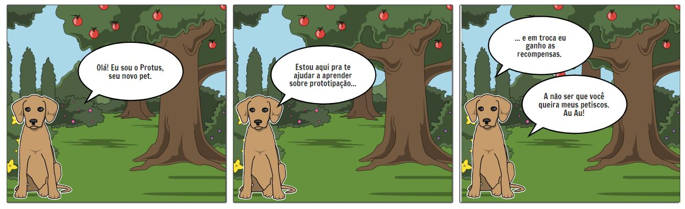

# Avaliação do Storyboard

Data | Versão | Descrição | Autor(es)
---- | ---- | ----| -----
04/09/2020 | 0.0 | Criação do documento | Gabriela
05/09/2020 | 0.1 | Adição Storyboads | Guilherme

### Perfil dos participantes

| Nome  | Idade  | Escolaridade   | Ocupação profissional |
|---|---|---|---|
| João | 22 | Ensino Superior Incompleto  | Estudante |
| Alice | 18 | Ensino Superior Incompleto  | Estudante |
| Victor Hugo | 25 | Ensino Superior Incompleto  | Estudante |

### Storyboards 

#### Storyboard 1

 

#### Storyboard 2

#### Storyboard 3

#### Storyboard 4

#### Storyboard 5

### Análise
Foram feitas 7 perguntas aos participantes:

- As atividades estão adequadas para faixa etária?

[Figura 1: Avaliação da faixa etária](./img/perg1.png)
- As atividades proporcionam o desenvolvimento de competências gerais pelo aluno/utilizador, sugeridas no currículo?

[Figura 2: Avaliação do desenvolvimento de competências por meio do jogo](./img/perg2.png)
- As atividades permitem um envolvimento ativo do professor?

[Figura 3: Avaliação da participação do professor](./img/perg3.png)
- A organização e apresentação da informação está simples de compreender?

[Figura 4: Avaliação da compreensão sobre o enredo por parte dos participantes](./img/perg4.png)
- A ideia do produto é agradável?

[Figura 5: Avaliação sobre a atratividade](./img/perg5.png)
- O personagem Protus (bichinho de estimação) transmite uma ideia/sentimento positivo?

[Figura 6: Avaliação sobre o Protus](./img/perg6.png)
- Possui alguma consideração a respeito da avaliação?

Os participantes da avaliação enquadram-se no perfil definido pelas Personas elaboradas.
O participante mais velho tem 25 anos e o mais jovem possue 18 anos e são alunos de graduação.
As atividades forma consideradas adequadas para a faixa etária, a ideia foi considerada agradável
e de fácil compreensão. Os participantes acreditam que o professor possui uma participação satisfatória no enredo do jogo.
O Protus também foi bem aceito pelos participantes.
Diante desses resultados podemos perceber que o público alvo possue interesse em utilizar o jogo em seu aprendizado.
Foi notado que mesmo usuários de uma faixa etária acima dos 20 anos pode achar a ideia de interagir com o Protus atraente.
Um dos comentários foi:

"Achei criativo e de fácil compreensão de qualquer pessoa que esteja interessada no assunto :-), amei o Protus"

Com isso podemos avaliar a aceitação da ideia dentre o nosso público alvo como tendo uma resposta positiva.

## Referências

>Storyboard 1,2,3,4,5 por Guilherme Leal (edição adaptada) em https://www.storyboardthat.com/