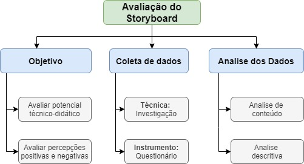

# Planejamento da Avaliação do ProtoGame

Data | Versão | Descrição | Autor(es)
 --- | ------ | --------- | ------
28/09/2020 | 0.0 | Criação do documento e Introdução |[Iolane Andrade](https://github.com/IolaneAndrade)
29/09/2020 | 0.1 | Metodologia das avaliações e avaliação do storyboard | [Iolane Andrade](https://github.com/IolaneAndrade)

## Introdução

Este documento é dedicado ao planejamento da avaliação do projeto ProtoGame. A avaliação de um produto é importante para  a garantia maior de qualidade, desta maneira, os problemas encontrados durante as avaliações devem ser corrigidos. Segundo BARBOSA e SILVA (2010, p.287) Os sistemas devem ser avaliados por três perspectivas. A de quem o concebe, quem o constrói e quem o utiliza. Para o desenvolvimento deste projeto, é importante avaliarmos a perspectiva de quem o concebe e quem utiliza o sistema. Desta maneira, a avaliação tem como objetivo verificar se o sistema apoia os usuários de forma adequada. 

## Metodologia

Para a avaliação do projeto, utilizaremos avaliação empírica em conjunto ao método de investigação. A avaliação empírica envolve um conjunto de potenciais utilizadores, externos a equipe, que avaliam  potenciais técnico-didático do sistema. O método de investigação(inquiry) envolve  o uso de questionário e/ou entrevistas semi-estruturada e uma análise qualitativa dos dados coletados.

## Storyboard

A avaliação do storyboard tem como objetivo avaliar o potencial técnico-didático dos mesmo. Para a coleta dos dados utilizaremos a técnica de investigação com a aplicação de questionários que visam abstrair percepções positivas e negativas dos utilizadores em relação aos storyboards. Na Figura 1 está ilustrada o esquema de avaliação do storyboard.

[Figura 1 - esquema de avaliação do storyboard.](./img/Avaliacao-storyboard.jpg)

Com os objetivos da avaliação definidos, elaboramos uma tabela com questões relacionadas ao objetivo.

Objetivo | Questão
------- | -------
**Potencial técnico-didático** | 1. As atividades estão adequadas para faixa etária?
  | 2. As atividades proporcionam o desenvolvimento de competências gerais pelo aluno/utilizador, sugeridas no currículo?
 | 3. As atividades permitem um desenvolvimento ativo do professor?
**Percepções positivas e negativas** | 1. A organização e apresentação da informação está simples de compreender?
 | 2. A ideia do produto é agradável?
 | 3. O personagem Protus(bichinho de estimação) transmite uma ideia/sentimento positivo?
 | 4. Possui alguma consideração a respeito da avaliação?

### Perfil e número de participantes

Segundo Nielsen (2003), são recomendados de três a quatro usuários na avaliação, entretanto, indica que o planejamento seja feito para 5 usuário, pois pode haver um usuário que não compareça a avaliação.

<cite>“Primeiro, deixe-me esclarecer que sempre recomendamos 3-4 usuários como o número ideal para a maioria dos estudos de usabilidade. O Motivo da minha recomendação mais ampla para planejar para 5 usuários é que isso permite um ou até dois não-comparecidos. Enquanto continua a observar 3-4 usuários. Assim, 5 é o número mágico durante o planejamento, enquanto o número mágico para o teste real é 3-4. (NIELSEN, J. 2003)” </cite>

Portanto, 5 pessoas serão selecionadas e uma persona para a avaliação, seguintes os critérios: ter entre 15 e 34 anos, ser um aluno e ter interesse em aprender sobre prototipação.
Buscou-se utilizar uma persona do grupo de usuários secundários do sistema. As características para a persona utilizada na avaliação serão da Persona 3 definida no  <a href= https://design-de-jogos.github.io/2020.1-Prototyping/Persona/>Documento de Descrição das Persona</a>. 

