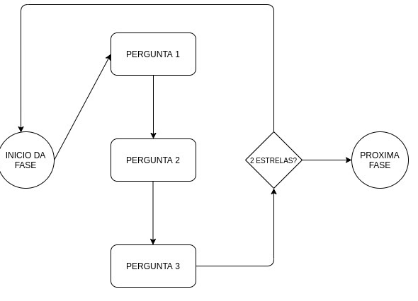
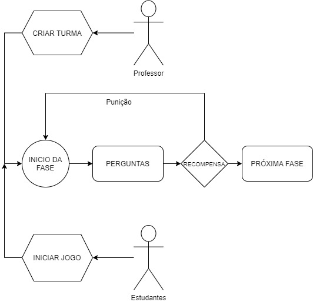
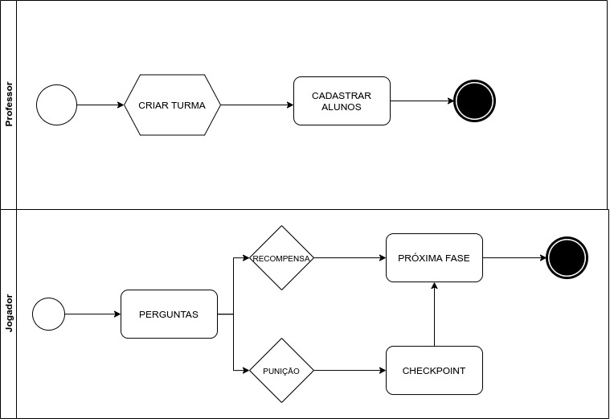

# Descrição do Jogo

Data | Versão | Descrição | Autor(es)
----- | ------ | -------- | --------
14/09/2020 | 0.0 | Definição do título, história, fluxo, personagens, gameplay e plataforma do jogo  | Guilherme, Gabriela, Iolane, Stéfane
18/09/2020 | 0.1 | Atualização da história do jogo e gameplay | Iolane
20/09/2020 | 0.2 | Atualização fluxo do game| Guilherme
14/11/2020 | 0.3 | Adicionando mapa do jogo e descrição dos módulos| Iolane Andrade
16/11/2020 | 0.4 | Adicionando checkpoint| Guilherme Leal
16/11/2020 | 0.4 | Adicionado fluxo na notação BPMN| Guilherme Leal

## Título do jogo

### ProtoGame

## História do jogo (Tarefas, Fases)

ProtoGame é um jogo onde o jogador recebe um bichinho de estimação, o Protus. Ao iniciar o jogo, é necessário que o usuário interaja com o bichinho alimentando-o, dando banho, remédios e entretendo-o. Para conseguir manter os níveis de alimentação, limpeza e saúde do bichinho satisfatórios é necessário que o jogador responda perguntas para ganhar recompensas para sustentar seu bichinho. As recompensas também contam como pontuação para que o jogador participar de um ranking

O tempo é um fator importante, pois é necessário alimentar o Protus diariamente para mantê-lo saudável. Desta maneira o jogador se manterá motivado a estudar todos os dias. Caso o jogador se afaste por muitos dias do jogo, os niveis de saúde do Protus diminuirão e se chegar à um determinado limite, o jogador recebe um aviso que a Sociedade Protetora dos Animais resgatou ele para ser adotado por um novo dono, resultando no status "Fim de Jogo".

O jogo contará com testes de múltiplas escolhas, memorização e desafios de associação e outros. Terá fases bloqueadas que serão liberadas de acordo com a pontuação do jogador, caso o jogador erre sua resposta, sofrerá uma penalidade. A penalidade funciona como as vidas do jogador, ele terá 5 chances para acertar a respostas e caso erre todas terá que reiniciar o jogo. Ao passar de cada fase o jogador irá receber pequenas recompensas que o ajudará no jogo e manter a saúde do Protus. Ao final de cada módulo o jogador recebe um conjunto de recompensas.

 O jogo será dividido em módulos sobre o tema de prototipação e cada módulo subdividido em tópicos. Cada tópico corresponderá a três perguntas, com feedback, ao final destas perguntas é atribuida uma pontuação referente a fase do jogo.

## Fluxo do jogo

[Figura 1: Fluxo do jogo. Fonte: Guilherme Leal](./img/fluxo-jogo.jpeg)

## Fluxo do jogo (v2)

[Figura 2: Fluxo do jogo. Fonte: Guilherme Leal](./img/fluxo_protogame.jp/g)

## Fluxo do jogo (Notação BPMN)

[Figura 3: Fluxo do jogo. Fonte: Guilherme Leal](./img/fluxo_protogame_bpmn.jpg)

## Mapa do jogo

Na Figura 3 está uma representação inicial simples do mapa do jogo protogame, com 6 módulos. 

[Figura 4: Versão 1 do mapa do ProtoGame. Fonte: Guilherme Leal](./img/MAPA-PROTOGAME-mapa.jpg)

### Módulos

 O jogo é constituído de 6 módulos, como mostra a figura 4 abaixo. São módulos de conceitos básicos, ideias e concepções, planejamento, checagem e validação, e análise e relato dos resultados. Todos sobre o tema de prototipação.  

[Figura 5: Descrição dos módulos e fases do jogo ProtoGame. Fonte: Guilherme Leal](./img/MAPA-PROTOGAME-modulos-fases.jpg)

## Personagem

Protus, mascote do jogo que acompanha o jogador durante todo o processo de aprendizado das fases.

## Gameplay

A dinâmica do jogo consiste em uma interação de perguntas e respostas. Alguns fatores importantes são:

  
  - **Para passar de fase:** o jogador pode atingir até 3 pontos. O jogador passa de fase ao atingir a pontuação mínima de 2 pontos ou mais.
  
  - **Vida:** O jogador inicia o jogo com 5 vidas.
  
  - **Fim de jogo**: O fim de jogo se dá de duas maneiras. A primeira é ao perder as 5 vidas. Uma vida é perdida ao errar uma questão. A segunda maneira é deixando os níveis de saúde do Protus chegarem a níveis críticos, desta maneira o Protus é levado para adoção.

  - **Recompensas:** Ao passar de fase o jogador conquista pequenas recompensas. Ao finalizar um módulo o jogador recebe um conjunto de recompensas.

  - **<i>Checkpoint</i>**: Ao perder as 5 vidas, o jogo retorna para o porto segura. Algumas fases terão essa característica para que o jogar possa retornar de um certo ponto. Por exemplo: a cada 5 fases o jogadore terá um <i>checkpoint</i>, ao chegar na fase 11 e atingir o fim do jogo, poderá retomar o jogo da fase 10. <b>Observação:</b> recompensas das fases que já foram concedidas não serão recebidas novamente.

## Plataforma

O jogo será disponibilizado por meio de um site, poderá ser jogado por dispositivos móveis ou computador.

## Referências

> Figura 1 por Guilherme Leal

> Figura 2 por Guilherme Leal

> Figura 3 por Guilherme Leal

> Figura 4 por Iolane Andrade

> Figura 5 por Iolane Andrade
