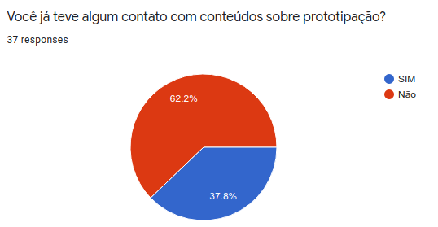
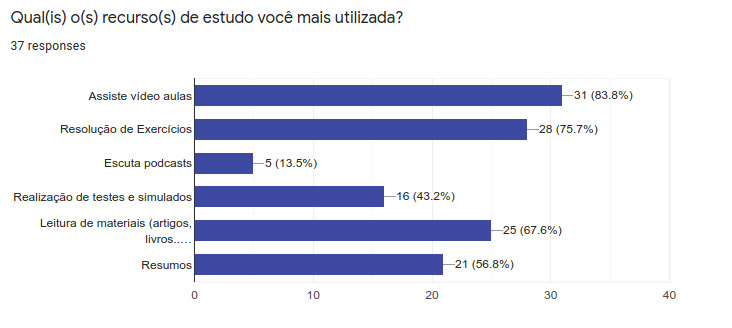

# Descrição do Usuário

Uma técnica utilizada para compreender melhor o nosso público alvo foi a aplicação de questionário. 

## Idade

Conforme pesquisa realizada, o nosso público alvo se encontra na faixa de 15 à 34 anos.

## Escolaridade

De acordo com a pesquisa, 56,8% dos partitipantes possuem Ensino Superior Incompleto. 24,3% possuem ensino superior completo. 10,8% Ensino Médio Completo. E 8,1% possui Pós-Graduação.

## Gênero

De acordo com a pesquisa, o nosso publico alvo é bem equilibrado em relação a gênero. 51,4% dos participantes eram do sexo masculino e 48,6% eram do sexo feminino.

## Práticas de estudo

De acordo com a pesquisa, 62,2% dos participantes nunca tiveram contato com temas relacionados a prototipação.

De acordo com a pesquisa, 81,1% dos participante demonstrou interesse em aprender sobre prototipação.

De acordo com a pesquisa, 56,8% dos participantes afirmam sentir maior dificuldade em assimilar a teoria do conteúdo.

De acordo com a pesquisa, 100% dos participantes afirmam utilizar o computador para estudar. Seguido de celular, com 62,2%.

De acordo com a pesquisa, Video aulas, com 83,8% e resolução de exercícios, com 75,7%, estão entre os recursos de estudo mais utilizados entre os participantes.

## Jodos Educacionais

De acordo com a pesquisa, 78,4% dos participantes não utiliza jogos educacionais como recurso para auxiliar os estudos.

