# Perfil do Usuário

Data | Versão | Descrição | Autor(es)
---- | ---- | ----| -----
08/09/2020 | 0.0 | Criação do documento | Equipe de GDD
10/09/2020 | 0.1 | Elaboração  e liberação do questionário | Equipe de GDD
14/09/2020 | 0.2 | Descrição da metodologia | Iolane
15/09/2020 | 0.3 | Coleta dos resultados | Iolane
05/10/2020 | 0.4 | Adição da tabela de questões usadas no questionário | Iolane 

## Metodologia

Uma técnica utilizada para compreender melhor o nosso público alvo foi a aplicação de questionário.
 

O questionário, segundo Gil (1999, p.128), é uma técnica de investigação quantitativa que tem como objetivo de conhecer as opiniões, crenças, sentimentos, interesses, expectativas, situações vivenciadas. O questionário é uma técnica que serve para coletar as informações da realidade. 

Segundo BARBOSA e SILVA (2010, p.134), os dados coletados sobre o usuário são relacionados a sua relação com tecnologia, seu conhecimento do domínio do produto e das tarefas que deverá realizar utilizando o produto.

Ao elaborarmos o questionário, o dividimos em três seções. Na primeira seção pedimos a autorização do uso dos dados na nossa pesquisa, e coletamos dados pessoas como: idade; faixa etária; escolaridade e gênero. Com o objetivo de conhecermos nosso público alvo. Na segunda seção coletamos dados relacionados a práticas de estudo e interesse em prototipação. Na terceira seção coletados dados relacionados a jogos educacionais, para entendermos a relação do nosso público com jogos. A tabela abaixo mostra as questões relacionadas aos seus objetivos.

Objetivo | Questões
-------- | -------
**Conhecer nosso público** | Qual a sua faixa etária?
  . | Qual seu maior nível de formação? 
  . | Qual é o seu gênero?
**Conhecer práticas de estudo** | Você já teve algum contato com conteúdos sobre prototipação?
 . | Você tem interesse em aprender prototipação?
 . | Em sua prática de estudos, qual parte do conteúdo você sente maior dificuldade de assimilação?
 . | Qual equipamento você costuma utilizar para auxiliar seus estudos?
 . | Qual(is) o(s) recurso(s) de estudo você mais utilizada?
 **Opniões relacionados a Jogos de Aprendizagem** | Você utiliza jogos educacionais para auxiliar na sua aprendizagem?
  . | Você gostaria de um jogo educacional que tivesse interação com outros jogadores?
  . | Você acha que os jogos educacionais são desafiadores para o aprendizado?
  . | Quais tipos de jogos você costuma jogar?
  . | Dê sua opinião sobre jogos educacionais. Nos dê um exemplo de um jogo que você goste ou como deveria ser um jogo que te motivaria a aprender.
  
  A aplicação dos questionários foi feita online. Os questionários foram elaborados no Google Forms e liberados nas redes sociais da Universidade de Brasilia e cursos técnicos. O questionário ficou aberto a participações do dia 10 de setembro ao dia 15 de setembro.

## Resultados

Para a análise dos resultados obtivemos 37 participações.

### Dados Pessoais

#### Idade

Conforme pesquisa realizada, o nosso público alvo se encontra na faixa de 15 à 34 anos ([Figura 1](./img/faixa-etaria.jpeg)).

[Figura 1: Resultado da pesquisa sobre idade dos usuários.](/img/faixa-etaria.jpeg)

#### Escolaridade

De acordo com a pesquisa, 56,8% dos partitipantes possuem Ensino Superior Incompleto. 24,3% possuem ensino superior completo. 10,8% Ensino Médio Completo. E 8,1% possui Pós-Graduação [Figura 2](./img/escolaridade.jpeg).

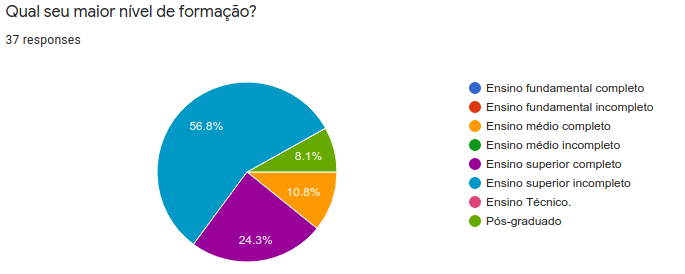

[Figura 2: Resultado da pesquisa sobre escolaridade dos usuários](./img/escolaridade.jpeg)

#### Gênero

De acordo com a pesquisa, o nosso publico alvo é bem equilibrado em relação a gênero. 51,4% dos participantes eram do sexo masculino e 48,6% eram do sexo feminino [Figura 3](./img/genero.jpeg).

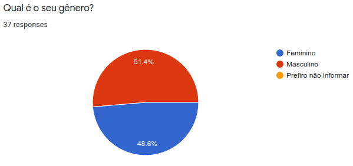

[Figura 3: Resultado da pesquisa sobre gênero dos usuários](./img/genero.jpeg)

### Práticas de estudo

#### Conhecimento

De acordo com a pesquisa, 62,2% dos participantes nunca tiveram contato com temas relacionados a prototipação [Figura 4](./img/contato-prototipacao.jpeg).

[Figura 4: Resultado da pesquisa sobre conhecimentos sobre protitipação](./img/contato-prototipacao.jpeg)

#### Interesse

De acordo com a pesquisa, 81,1% dos participante demonstrou interesse em aprender sobre prototipação [Figura 5](./img/aprender-prototipacao.jpeg).

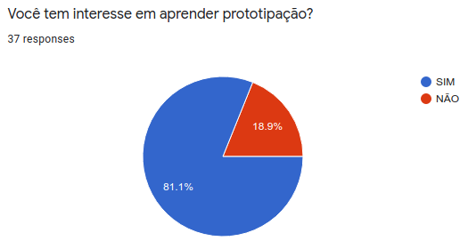

[Figura 5: Resultado da pesquisa sobre interesse no tema prototipação](./img/aprender-prototipacao.jpeg).

#### Dificuldade em assimilação de conteúdo

De acordo com a pesquisa, 56,8% dos participantes afirmam sentir maior dificuldade em assimilar a teoria do conteúdo [Figura 6.](./img/teoria-pratica.jpeg).

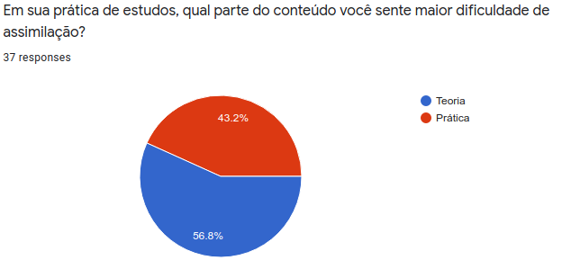

[Figura 6: Resultado da pesquisa sobre dificuldade em assimilação de conteúdo](./img/teoria-pratica.jpeg).

#### Ferramentas de estudo

De acordo com a pesquisa, 100% dos participantes afirmam utilizar o computador para estudar. Seguido de celular, com 62,2% [Figura 7](./img/equipamentos-estudos.jpeg).

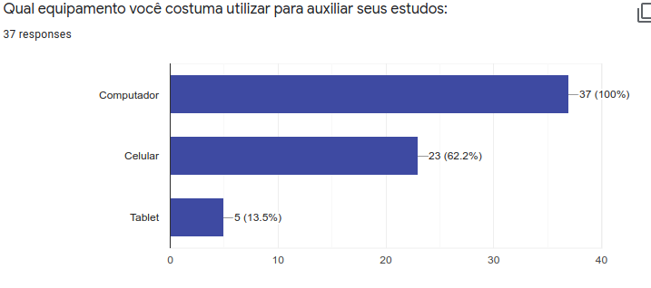

[Figura 7: Resultado da pesquisa sobre ferramentas utilizadas nos estudos](./img/equipamentos-estudos.jpeg)

#### Recursos auxiliares

De acordo com a pesquisa, Video aulas, com 83,8% e resolução de exercícios, com 75,7%, estão entre os recursos de estudo mais utilizados entre os participantes [Figura 8](./img/recursos.jpeg).

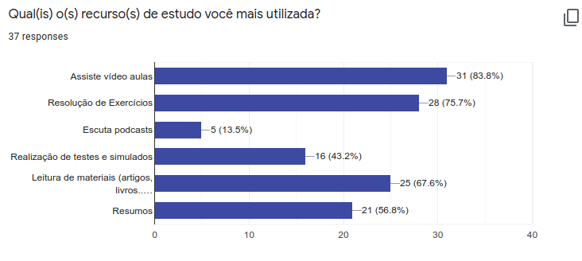

[Figura 8: Resultado da pesquisa sobre recursos auxiliares](./img/recursos.jpeg)

### Jodos Educacionais

#### Relação com jogos educacionais

De acordo com a pesquisa, 78,4% dos participantes não utiliza jogos educacionais como recurso para auxiliar os estudos [Figura 9](./img/utiliza-jogos.jpeg).

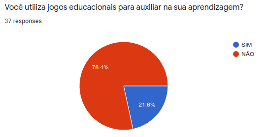

[Figura 9: Resultado da pesquisa sobre a relação com os jogos educacionais](./img/utiliza-jogos.jpeg)

#### Preferencias de interação
De acordo com a pesquisa, 91,9% dos participantes gostariam que houvessem alguma interação com outros jogadores em jogos educacionais [Figura 10](./img/interacao-jogos.jpeg).

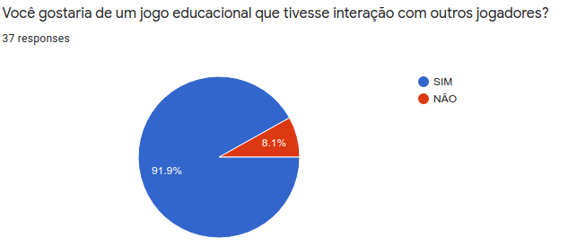

[Figura 10: Resultado da pesquisa sobre preferencias de interação](./img/interacao-jogos.jpeg).

#### Opnião
De acordo com a pesquisa, 73% acredita que os jogos educaionais são desafiadores para o aprendizado [Figura 11](./img/desafiadores.jpeg).

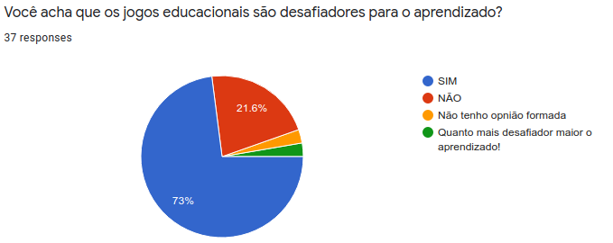

[Figura 11: Resultado da pesquisa de opnião](./img/desafiadores.jpeg)

#### Preferências de tipos de jogos

De acordo com a pesquisa, Jogos de perguntas e respostas e jogos de estratégias são os mais jogados dentre os participantes[Figura 12](./img/tipo-jogo.jpeg).

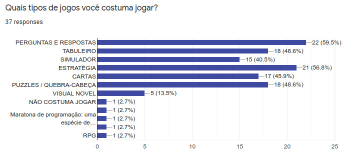

[Figura 12: Resultado da pesquisa sobre a preferência de tipos de jogos](./img/tipo-jogo.jpeg)

#### Questão aberta

Foi elaborada uma questão aberta para que os participantes da pesquisa desse sua opiniões relacionadas ao tema.
Elaboramos um gráfico com as palavras mais recorrentes dentre as respostas ([Figura 13](./img/grafico-palavras.jpeg))

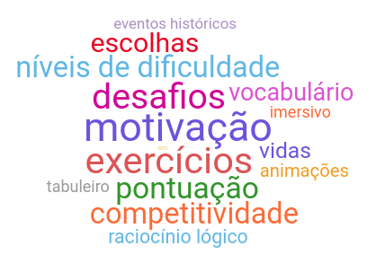

[Figura 13: gráfico de palavras](./img/grafico-palavras.jpeg)

## Referências

>CHAER, Galdino; DINIZ, Rafael Rosa Pereira; RIBEIRO, Elisa Antônia. **A técnica do questionário na pesquisa educacional.** Revista Evidência, v. 7, n. 7, 2012. Disponível em: [http://www.educadores.diaadia.pr.gov.br/arquivos/File/maio2013/sociologia_artigos/pesqusia_social.pdf](http://www.educadores.diaadia.pr.gov.br/arquivos/File/maio2013/sociologia_artigos/pesqusia_social.pdf)

>BARBOSA, Simone; SILVA, Bruno. **Interação humano-computador.** Elsevier Brasil, 2010.
