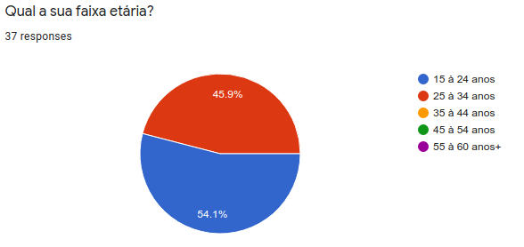

# Perfil do Usuário

Data | Versão | Descrição | Autor(es)
---- | ---- | ----| -----
08/09/2020 | 0.0 | Criação do documento | Equipe de GDD
10/09/2020 | 0.1| Elaboração  e liberação do questionário | Equipe de GDD
14/09/2020 | 0.2 | Descrição da metodologia | Iolane
15/09/2020 | 0.2 | Coleta dos resultados | Iolane

## Metodologia

Uma técnica utilizada para compreender melhor o nosso público alvo foi a aplicação de questionário.
 

O questionário, segundo Gil (1999, p.128), é uma técnica de investigação quantitativa que tem como objetivo o conhecer as opiniões, crenças, sentimentos, interesses, expectativas, situações vivenciadas. O questionário é uma técnica que serve para coletar as informações da realidade. 

Segundo Simone (2010, p.134), os dados coletados sobre o usuário são relacionados a sua relação com tecnologia, seu conhecimento do domínio do produto e das tarefas que deverá realizar utilizando o produto.

Ao elaborarmos o questionário, o dividimos em três seções. Na primeira seção pedimos a autorização do uso dos dados na nossa pesquisa, e coletamos dados pessoas como: idade; faixa etária; escolaridade e gênero. Com o objetivo de conhecermos nosso público alvo. Na segunda seção coletamos dados relacionados a práticas de estudo e interesse em prototipação. Na terceira seção coletados dados relacionados a jogos educacionais, para entendermos a relação do nosso público com jogos.

## Resultados

### Dados Pessoais

#### Idade

Conforme pesquisa realizada, o nosso público alvo se encontra na faixa de 15 à 34 anos.

#### Escolaridade

De acordo com a pesquisa, 56,8% dos partitipantes possuem Ensino Superior Incompleto. 24,3% possuem ensino superior completo. 10,8% Ensino Médio Completo. E 8,1% possui Pós-Graduação.

#### Gênero

De acordo com a pesquisa, o nosso publico alvo é bem equilibrado em relação a gênero. 51,4% dos participantes eram do sexo masculino e 48,6% eram do sexo feminino.

### Práticas de estudo

#### Conhecimento

De acordo com a pesquisa, 62,2% dos participantes nunca tiveram contato com temas relacionados a prototipação.

#### Interesse

De acordo com a pesquisa, 81,1% dos participante demonstrou interesse em aprender sobre prototipação.

#### Dificuldade em assimilação de conteúdo

De acordo com a pesquisa, 56,8% dos participantes afirmam sentir maior dificuldade em assimilar a teoria do conteúdo.

#### Ferramentas de estudo

De acordo com a pesquisa, 100% dos participantes afirmam utilizar o computador para estudar. Seguido de celular, com 62,2%.

#### Recursos auxiliares

De acordo com a pesquisa, Video aulas, com 83,8% e resolução de exercícios, com 75,7%, estão entre os recursos de estudo mais utilizados entre os participantes.

### Jodos Educacionais

#### Relação com jogos educacionais

De acordo com a pesquisa, 78,4% dos participantes não utiliza jogos educacionais como recurso para auxiliar os estudos.

#### Preferencias de interação
De acordo com a pesquisa, 91,9% dos participantes gostariam que houvessem alguma interação com outros jogadores em jogos educacionais.

#### Opnião
De acordo com a pesquisa, 73% acredita que os jogos educaionais são desafiadores para o aprendizado.

#### Preferências de tipo de jogos

De acordo com a pesquisa, Jogos de perguntas e respostas e jogos de estratégias são os mais jogados dentre os participantes.

## Referências

CHAER, Galdino; DINIZ, Rafael Rosa Pereira; RIBEIRO, Elisa Antônia. **A técnica do questionário na pesquisa educacional.** Revista Evidência, v. 7, n. 7, 2012. Disponível em: [http://www.educadores.diaadia.pr.gov.br/arquivos/File/maio2013/sociologia_artigos/pesqusia_social.pdf](http://www.educadores.diaadia.pr.gov.br/arquivos/File/maio2013/sociologia_artigos/pesqusia_social.pdf)

BARBOSA, Simone; SILVA, Bruno. **Interação humano-computador.** Elsevier Brasil, 2010.
