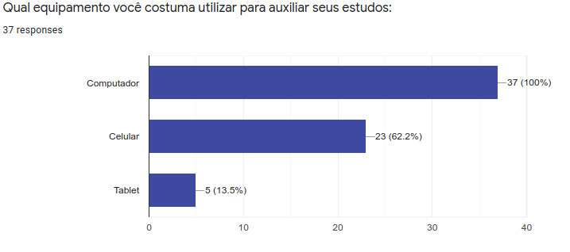

# Perfil do Usuário

Data | Versão | Descrição | Autor(es)
---- | ---- | ----| -----
08/09/2020 | 0.0 | Criação do documento | Equipe de GDD
10/09/2020 | 0.1 | Elaboração  e liberação do questionário | Equipe de GDD
14/09/2020 | 0.2 | Descrição da metodologia | Iolane
15/09/2020 | 0.3 | Coleta dos resultados | Iolane
05/10/2020 | 0.4 | Adição da tabela de questões usadas no questionário | Iolane 
01/12/2020 | 0.5 | Revisão do documento | Stéfane Souza

## Metodologia

Uma técnica utilizada para compreender melhor o nosso público alvo foi a aplicação de questionário.
 

O questionário, segundo Gil (1999, p.128), é uma técnica de investigação quantitativa que tem como objetivo de conhecer as opiniões, crenças, sentimentos, interesses, expectativas, situações vivenciadas. O questionário é uma técnica que serve para coletar as informações da realidade. 

Segundo BARBOSA e SILVA (2010, p.134), os dados coletados sobre o usuário são relacionados a sua relação com tecnologia, seu conhecimento do domínio do produto e das tarefas que deverá realizar utilizando o produto.

Ao elaborarmos o questionário, o dividimos em três seções. Na primeira seção pedimos a autorização do uso dos dados na nossa pesquisa, e coletamos dados pessoas como: idade; faixa etária; escolaridade e gênero. Com o objetivo de conhecermos nosso público alvo. Na segunda seção coletamos dados relacionados a práticas de estudo e interesse em prototipação. Na terceira seção coletados dados relacionados a jogos educacionais, para entendermos a relação do nosso público com jogos. A tabela abaixo mostra as questões relacionadas aos seus objetivos.

##### Tabela 1 - Questionário para o Público-Alvo

Objetivo | Questões
-------- | -------
**Conhecer nosso público** | Qual a sua faixa etária?
  . | Qual seu maior nível de formação? 
  . | Qual é o seu gênero?
**Conhecer práticas de estudo** | Você já teve algum contato com conteúdos sobre prototipação?
 . | Você tem interesse em aprender prototipação?
 . | Em sua prática de estudos, qual parte do conteúdo você sente maior dificuldade de assimilação?
 . | Qual equipamento você costuma utilizar para auxiliar seus estudos?
 . | Qual(is) o(s) recurso(s) de estudo você mais utilizada?
 **Opniões relacionados a Jogos de Aprendizagem** | Você utiliza jogos educacionais para auxiliar na sua aprendizagem?
  . | Você gostaria de um jogo educacional que tivesse interação com outros jogadores?
  . | Você acha que os jogos educacionais são desafiadores para o aprendizado?
  . | Quais tipos de jogos você costuma jogar?
  . | Dê sua opinião sobre jogos educacionais. Nos dê um exemplo de um jogo que você goste ou como deveria ser um jogo que te motivaria a aprender.

##### Fonte: Autor (2020)
  
  
A aplicação dos questionários foi feita online. Os questionários foram elaborados no Google Forms e liberados nas redes sociais da Universidade de Brasilia e cursos técnicos. O questionário ficou aberto a participações do dia 10 de setembro ao dia 15 de setembro.

## Resultados

Para a análise dos resultados obtivemos 37 participações.

### Dados Pessoais

#### Idade

Conforme pesquisa realizada, o nosso público alvo se encontra na faixa de 15 à 34 anos ([Figura 1](./img/faixa-etaria.jpeg)).

[Figura 1: Resultado da Pesquisa sobre Idade dos Usuários](/img/faixa-etaria.jpeg)

##### Fonte: Autor (2020)

#### Escolaridade

De acordo com a pesquisa, 56,8% dos partitipantes possuem Ensino Superior Incompleto. 24,3% possuem ensino superior completo. 10,8% Ensino Médio Completo. E 8,1% possui Pós-Graduação [Figura 2](./img/escolaridade.jpeg). 

[Figura 2: Resultado da Pesquisa sobre Escolaridade dos Usuários](./img/escolaridade.jpeg)

##### Fonte: Autor (2020)

#### Gênero

De acordo com a pesquisa, o nosso publico alvo é bem equilibrado em relação a gênero. 51,4% dos participantes eram do sexo masculino e 48,6% eram do sexo feminino [Figura 3](./img/genero.jpeg).

[Figura 3: Resultado da Pesquisa sobre Gênero dos Usuários](./img/genero.jpeg)

##### Fonte: Autor (2020)

### Práticas de Estudo

#### Conhecimento

De acordo com a pesquisa, 62,2% dos participantes nunca tiveram contato com temas relacionados a prototipação [Figura 4](./img/contato-prototipacao.jpeg).

[Figura 4: Resultado da Pesquisa sobre Conhecimentos sobre Protitipação](./img/contato-prototipacao.jpeg)

##### Fonte: Autor (2020)

#### Interesse

De acordo com a pesquisa, 81,1% dos participante demonstrou interesse em aprender sobre prototipação [Figura 5](./img/aprender-prototipacao.jpeg).

[Figura 5: Resultado da Pesquisa sobre Interesse em Prototipação](./img/aprender-prototipacao.jpeg).

##### Fonte: Autor (2020)

#### Dificuldade em Assimilação de Conteúdo

De acordo com a pesquisa, 56,8% dos participantes afirmam sentir maior dificuldade em assimilar a teoria do conteúdo [Figura 6.](./img/teoria-pratica.jpeg).

[Figura 6: Resultado da Pesquisa sobre Dificuldade em Assimilação de Conteúdo](./img/teoria-pratica.jpeg).

##### Fonte: Autor (2020)

#### Ferramentas de Estudo

De acordo com a pesquisa, 100% dos participantes afirmam utilizar o computador para estudar. Seguido de celular, com 62,2% [Figura 7](./img/equipamentos-estudos.jpeg).

[Figura 7: Resultado da Pesquisa sobre Ferramentas Utilizadas nos Estudos](./img/equipamentos-estudos.jpeg)

##### Fonte: Autor (2020)

#### Recursos Auxiliares

De acordo com a pesquisa, Video aulas, com 83,8% e resolução de exercícios, com 75,7%, estão entre os recursos de estudo mais utilizados entre os participantes 
[Figura 8](./img/recursos.jpeg). 

[Figura 8: Resultado da Pesquisa sobre Recursos Auxiliares](./img/recursos.jpeg)

##### Fonte: Autor (2020)

### Jogos Educacionais

#### Relação com Jogos Educacionais

De acordo com a pesquisa, 78,4% dos participantes não utiliza jogos educacionais como recurso para auxiliar os estudos 
[Figura 9](./img/utiliza-jogos.jpeg).

[Figura 9: Resultado da Pesquisa sobre a Relação com os Jogos Educacionais](./img/utiliza-jogos.jpeg)

##### Fonte: Autor (2020)

#### Preferencias de Interação

De acordo com a pesquisa, 91,9% dos participantes gostariam que houvessem alguma interação com outros jogadores em jogos educacionais 
[Figura 10](./img/interacao-jogos.jpeg).

[Figura 10: Resultado da Pesquisa sobre Preferências de Interação](./img/interacao-jogos.jpeg).

##### Fonte: Autor (2020)

#### Opinião

De acordo com a pesquisa, 73% acredita que os jogos educaionais são desafiadores para o aprendizado 
 [Figura 11](./img/desafiadores.jpeg).

[Figura 11: Resultado da Pesquisa de Opinião](./img/desafiadores.jpeg)

##### Fonte: Autor (2020)

#### Preferências de Tipos de Jogos

De acordo com a pesquisa, Jogos de perguntas e respostas e jogos de estratégias são os mais jogados dentre os participantes 
[Figura 12](./img/tipo-jogo.jpeg).

[Figura 12: Resultado da Pesquisa sobre a Preferência de Tipos de Jogos](./img/tipo-jogo.jpeg)

##### Fonte: Autor (2020)

#### Questão Aberta

Foi elaborada uma questão aberta para que os participantes da pesquisa desse sua opiniões relacionadas ao tema. Elaboramos um gráfico com as palavras mais recorrentes dentre as respostas. 
([Figura 13](./img/grafico-palavras.jpeg))

[Figura 13: Gráfico de Palavras](./img/grafico-palavras.jpeg)

##### Fonte: Autor (2020)

## Referências

>CHAER, Galdino; DINIZ, Rafael Rosa Pereira; RIBEIRO, Elisa Antônia. **A técnica do questionário na pesquisa educacional.** Revista Evidência, v. 7, n. 7, 2012. Disponível em: [http://www.educadores.diaadia.pr.gov.br/arquivos/File/maio2013/sociologia_artigos/pesqusia_social.pdf](http://www.educadores.diaadia.pr.gov.br/arquivos/File/maio2013/sociologia_artigos/pesqusia_social.pdf)

>BARBOSA, Simone; SILVA, Bruno. **Interação humano-computador.** Elsevier Brasil, 2010.
