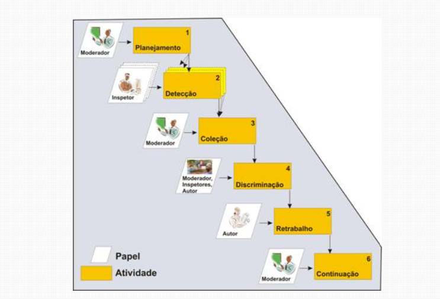
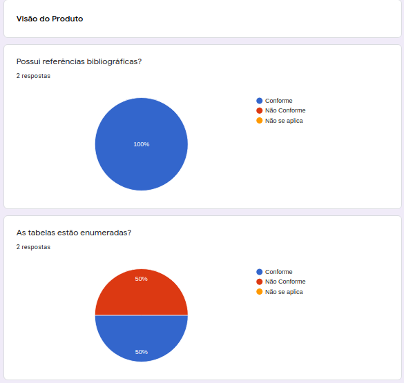

# Planejamento e Execução de Inspeção

Data | Versão | Descrição | Autor(es)
----- | ------ | -------- | --------
14/09/2020 | 0.0 | Checklist e Planejamento  | Gabriela
01/12/2020 | 0.1 | Execução da Inspeção e Atualização dos Documentos  | Stéfane Souza

## Planejamento

##### Figura 1 - Processo de Inspeção

Na fase de planejamento da Inspeção, a equipe se prepara para a execução dos procedimentos que devem ser aplicados. A Inspeção possuei uma lógica e papeis como ilustrados pela Figura 1. 

##### Fonte: Dev Media (2008)

No caso do nosso projeto os papeis são definidos como:

Moderadora(a): Gabriela  
Inspetores: Guilherme, Iolane e Stéfane

As atividades incluem o preenchimento do formulário elaborado em forma de checklist e com perguntas de avaliação sobre todos os artefatos gerados durante o desenvolvimento do preojeto.
As perguntas avaliam sob critérios básicos para um bom texto como: 

* As tabelas estão enumeradas?  
* Possui erros ortográficos?  
* Possui bibliografia?  

E também incluem perguntas que verificam se foram atendidas as recomendações dadas pelo professor da disciplina. Além disso, perguntas específicas para cada artefato afim de verificar sua qualidade. O formulário está disponível logo abaixo.

### Checklist

* [Checklist de inspeção do projeto ProtoGame](https://docs.google.com/forms/d/e/1FAIpQLSeYJQ9n3wla_-lL0tBXR0LTkZCaO5Qc6UeN7cjsJjvkvIcU2Q/viewform?usp=sf_link)

## Execução da Inspeção 

 A execução da Inspeção foi realizada da seguinte maneira: A checklist disponibilidade por meio de um Formulário Google foi respondida pela inspetora Stéfane Souza depois da finalização de todos os documentos. Logo após responder o formulário foram identificados erros em diversos documentos. Assim a inspetora iniciou a correção e revisão de cada um deles, por fim a checklist foi respondida novamente para verificar se os erros encontrados foram corrigidos. Tudo foi rastreado por meio dos resultados em gráfico que o próprio formulário disponibiliza.

 A figura abaixo mostra um exemplo dos resultados do gráfico antes e depois da execução da verificação dos documentos.

##### Figura 2 - Exemplo de Execução da Inspeção

##### Fonte: Autor (2020)

## Referências

>Lista de Verificação da Qualidade de Artefatos - Checklist Ágil. Disponível em: https://www.gov.br/agricultura/pt-br/pregao-eletronico-no-05-2018/diretrizes/lista-de-verificacao-da-qualidade-de-artefatos-checklist-agil.xls/view](https://www.gov.br/agricultura/pt-br/pregao-eletronico-no-05-2018/diretrizes/lista-de-verificacao-da-qualidade-de-artefatos-checklist-agil.xls/view). Acesso em: 30/11/2020

>Artigo Engenharia de Software - Introdução à Inspeção de Software. Disponível em: https://www.devmedia.com.br/artigo-engenharia-de-software-introducao-a-inspecao-de-software/8037](https://www.devmedia.com.br/artigo-engenharia-de-software-introducao-a-inspecao-de-software/8037). Acesso em: 30/11/2020

