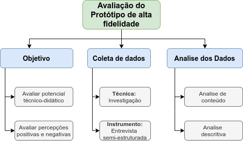
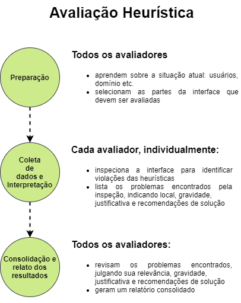

# Planejamento da Avaliação do ProtoGame

Data | Versão | Descrição | Autor(es)
 --- | ------ | --------- | ------
28/09/2020 | 0.0 | Criação do documento e Introdução |[Iolane Andrade](https://github.com/IolaneAndrade)
03/11/2020 | 0.1 | imagem do fluxo da avaliação heuristica | [Iolane Andrade](https://github.com/IolaneAndrade)
05/11/2020 | 0.2 | fluxo da avaliação heuristica | [Iolane Andrade](https://github.com/IolaneAndrade)

## Introdução

Este documento é dedicado ao planejamento da avaliação do projeto ProtoGame. A avaliação de um produto é importante para  a garantia maior de qualidade, desta maneira, os problemas encontrados durante as avaliações devem ser corrigidos. Segundo BARBOSA e SILVA (2010, p.287) Os sistemas devem ser avaliados por três perspectivas. A de quem o concebe, quem o constrói e quem o utiliza. Para o desenvolvimento deste projeto, é importante avaliarmos a perspectiva de quem o concebe e quem utiliza o sistema. Desta maneira, a avaliação tem como objetivo verificar se o sistema apoia os usuários de forma adequada. 

## Metodologia

Para a avaliação do projeto, utilizaremos avaliação empírica em conjunto ao método de investigação. A avaliação empírica envolve um conjunto de potenciais utilizadores, externos a equipe, que avaliam  potenciais técnico-didático do sistema. O método de investigação(inquiry) envolve  o uso de questionário e/ou entrevistas semi-estruturada e uma análise qualitativa dos dados coletados.

## Protótipo de alta fidelidade

A avaliação do protótipo de alta fidelidade seguirá o mesmo modelo da avaliação do protótipo de papel e tem como objetivo avaliar o potencial técnico-didático do mesmo. Para a coleta dos dados utilizaremos a técnica de investigação com a aplicação de uma entrevista semi-estruturada que visam abstrair percepções positivas e negativas dos utilizadores em relação ao protótipo. Na Figura 1 está ilustrada o esquema de avaliação do protótipo de papel.

[Figura 1 - esquema de avaliação do protótipo de alta fidelidade. Fonte: autor](./img/Planejamento-Avaliacao-alta-fidelidade.jpg)

Com os objetivos da avaliação definidos, elaboramos uma tabela com questões relacionadas ao objetivo que auxiliarão na condução da entrevista.

Objetivo | Questão
------- | -------
**Potencial técnico-didático** | 1. As atividades do professor estão adequadas?
  .                            | 2. As atividades do professor estão claras?
  .                            | 3. O fluxo das atividades do professor estão intuitivas?
  .                            | 4. As atividades do aluno estão adequadas?
  .                            | 5. As atividades do aluno estão claras?
  .                            | 6. O fluxo das atividades do aluno estão intuitivas?
**Percepções positivas e negativas** | 1. A organização e apresentação da informação está simples de compreender?
  .                                  | 2. A ideia do produto é agradável?
  .                                  | 3. O personagem Protus(bichinho de estimação) transmite uma ideia/sentimento positivo?
  .                                  | 4. Você se sentiu frustrado em algum momento da avaliação?
  .                                  | 5. Em caso afirmativo, descreva quais atividades causaram frustração.
  .                                  | 6. De modo geral, qual a sua opnião sobre o produto?

### Fluxo da avaliação heurística

Para o fluxo da avaliação heurística, BARBOSA e SILVA indicam alguns ṕassos importantes, são eles: Preparação, Coleta de dados e interpretação, Consolidação e relato dos resultados. Estes passos estão ilustrados na figura 2 

[Figura 2: avaliação heuristica. Fonte: autor](./img/avaliacao-heuristica.jpg)

A fase de <b>Preparação</b> é muito importante para que o avaliador tenha ciência do contexto a ser avaliado e possa fazer boas considerações durante a avaliação. É importante que as atividades sejam definidas antes de iniciar a avaliação. Na fase de <b>Coleta de dados e interpretação</b>, é importante que o avaliador fale em voz alta a respeito dos defeitos ou considerações durante a atividade. Essas considerações devem ser anotadas e debatidas entre a equipe, classificando a relevância e gravidade. Isto é feito na ultima fase de <b>Consolidação e relato dos resultados</b>. 

### Perfil e número de participantes

Para esta avaliação foram selecionados quatro participantes. 

## Referências

>BARBOSA, Simone; SILVA, Bruno. **Interação humano-computador**. Elsevier Brasil, 2010.

>NIELSEN, Jakob. **Usability engineering**. Morgan Kaufmann, 1994.
