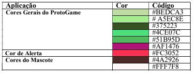

# Guia de Estilo de Usabilidade do ProtoGame 

Data | Versão | Descrição | Autor(es)
---- | ---- | ----| -----
19/09/2020 | 0.0 | Criação do documento | Equipe de GDD
19/09/2020 | 0.1 | Desenvolvimento | Gabriela
19/09/2020 | 0.2 | Atualização da Wiki | Iolane
01/12/2020 | 0.3 | Revisão do documento | Stéfane Souza

## 1. Introdução 

### 1.1 Objetivo do Documeto  

O Guia de Estilo de Usabilidade tem como objetivo estabelecer padrões, na forma de diretrizes para o desenho da interface com o usuário. Os padrões definidos no Guia visamgarantir a  consistência interna e externa do desenho da interface com o usuário do software ProtoGame. 

### 1.2 Audiência do Documento 

Desenvolvedores autores do documento. 

### 1.3 Intenção de Uso do Documento 

 O Guia de Estilo de Usabilidade é utilizado como um padrão que guia o desenho da interface do usuário. Normalmente, o Guia é desenvolvido ou atualizado junto como projeto da interface com o usuário. Para o desenvolvedor da interação, serve como referência para o desenho da interface e como registro de novos padrões estabelecidos. Para os usuário e cliente, o Guia deve ser usado como uma meta-documentação do desenho da interface externa. 

 Este Guia, contém um conjunto de regras e orientações, cuja principal preocupação é a  padronização dos produtos da família Protogame e dos processos envolvidos na elaboração de suas interfaces.
 
As principais vantagens do uso deste documento são: 

- Assegura a consistência através de uma família de produtos. 

- Fomenta e facilita o trabalho conjunto de desenvolvedores e usuários. No desenho da interface, os usuários podem participar mais intensamente da elaboração do Guia, definindo os padrões que são utilizados pelos desenvolvedores no desenho da interface com o usuário. 

- Contém um repositório de diretrizes e padrões. 

- Pode ser utilizado para auxílio ao treinamento de novos 
desenvolvedores. Minimiza a reinvenção e beneficia o re-uso. 

- Diminui o tempo de desenvolvimento

### 1.4 Estilo do Documento 

 Este Guia define padrões para o desenho da interface com o usuário dos produtos da família ProtoGame. 

### 1.5 Consistência com outros padrões 

 Este Guia herda os padrões estabelecidos no Guia de Estilo da Equipe 4 da disciplina de  Seminários de Software. 

### 1.6 Dados do Projetos
 
 _| Descrição
---- | ----- 
Projeto | ProtoGame 
Data inicial / Data Atual | 19 de agosto de 2020 / 19 de setembro de 2020  
Equipe | Papel | Gabriela Desenvolvedora 
_ | Guilherme Desenvolvedor
_ | Iolane Desenvolvedora  
_ | Stefane Desenvolvedora 

##### Tabela 1 - Dados do Projetos

### 1.7 Organização do documento 

Este documento está dividido nas seguintes partes: 

1. **Introdução:** Apresenta contexto onde o Guia será utilizado 

2. **Conceitos Preliminares:** Apresenta principais conceitos relacionados á usabilidade. Visa orientar o leitor quanto a esses aspectos. 

3. **Diretrizes Gerais:** Apresenta princípios de desenho, diretrizes de usabilidade e diretrizes que devem ser observados no desenho da interface como usuário. 

4. **Padrões Específicos de Produtos:** Padrões e consistências específicos para os produtos no escopo do Guia. 

5. **Glossário**

6. **Bibliografia**

## 2. Conceitos preliminares 

 Alguns dos principais elementos que devem ser levados em conta no processo de produção de interfaces são: usabilidade, consistência, navegabilidade, interatividade, clareza, flexibilidade, funcionalidade e legibilidade. Vale ressaltar que o item “usabilidade” é mais genérico e envolve de uma certa maneira todos os outros itens listados. 

 <b>Usabilidade</b>, segundo a norma ISO 9241, é a capacidade que um sistema interativo oferece a seu usuário, em um determinado contexto de operação, para a realização de tarefas de maneira eficaz, eficiente e agradável. Pode ser vista como uma propriedade que um produto de software deve ter de tal forma que os usuários típicos possam operar bem esse software para realizar as tarefas de que necessitam. Usabilidade pode ser considerada como a característica de adequação ao uso de um  produto de software, onde a adequação ao uso pode se desdobrar em cinco atributos principais: desempenho do usuário, facilidade de aprendizado, retenção do aprendizado com o uso intermitente, prevenção de erros do usuário e satisfação do usuário. 

 <b>Consistência</b> refere-se à coerência na aplicação de regras de uso dos dispositivos ou itens de interface. Todos os elementos que possuem as mesmas funções devemapresentar as mesmas características gráficas e operacionais. O reconhecimento imediato da função de um determinado item de interface pelo usuário é algo que se deve buscar sempre que se busca a padronização. Pode- se notar que a consistência contribui para melhorar a qualidade da interface em termos de todos os cinco principais atributos de usabilidade. É importante lembrar que a consistência pode envolver diversos aspectos. Os seguintes tipos de consistência são desejáveis: 

- Expectativa dos usuários; 

- Entre aplicações relacionadas ou aplicações de uma mesma organização; 

- Com outros guias de estilo. Pode-se utilizar uma organização hierárquica de guias de estilo; Com padrões existentes na cultura da área; 

- De terminologia; 

- Entre páginas ou entre telas;

- Dentro de páginas, 
janelas; Ícones; 

- Mensagens de diálogo, especificamente em mensagens de erro.

 <b>Navegabilidade</b> é a propriedade, ou capacidade, que a interface do site possui de facilitar ao usuário chegar ao seu destino da maneira o mais eficiente possível. Corresponde à qualidade da estrutura viária que dá acesso ao conteúdo das informações no site.

 <b>Interatividade</b> relaciona-se às interações do usuário que são um conjunto de operações ou  atividades que o usuário põe em prática com os objetos de tal modo a alterar o ambiente. No  projeto das ações do usuário deve ser detalhado como cada ação será representada, como o usuário vai pôr em prática a ação, e como será o efeito da ação completada.

 <b>Clareza</b> diz respeito à evidência de se encontrar os itens principais da interface, ou seja, eles  devem ser claros o suficiente para que não haja dúvid a sobre sua funcionalidade e seu uso. Se não são evidentes, devem ser auto-explicativos.
 

 <b>Flexibilidade</b> se refere aos meios colocados à disposição do usuário que lhe permitempersonalizar a interface, a fim de levar em conta as exigências da tarefa, de suas estratégias ou seus hábitos de trabalho. Ela corresponde também ao número das diferentes maneiras à disposição do usuário para alcançar um certo objetivo. Trata-se, em outros termos, da capacidade da interface de se adaptar as variadas ações do usuário. 

 <b>Legibilidade</b> diz respeito às características lexicais das informações apresentadas na tela que  possam dificultar ou facilitar a leitura dessa informação (brilho do caractere, contraste letra/fundo, tamanho da fonte, espaçamento entre palavras espaçamento entre linhas, espaçamento de parágrafos, comprimento da linha, etc).

## 3. Padrões específicos da família de produtos 

### 3.1 Aspectos gerais 

 A aplicação deve permitir o acesso fácil a tela principal. O usuário deve se sentir confortável com as cores e  fontes. As escolhas acerca do design devem seguir o padrão determinado nesse documento.

#### 3.1.1 Organização de telas 

- Tela de perfil do usuário 

- Tela para entrar ou não em uma turma 

- Tela inicial do jogo com a visualização geral das fases a serem alcançadas 

- Telas de interação de cada fase 

### 3.2 Padrões de comportamento da interface  

#### 3.2.1 Função/Comportamento dos Botões 

Rótulo | Interfaces onde está presente | Função/ Comportamento
------- | --------- | -------
“Cancelar” | Toda interface que contenha dados editáveis ou ações  reversíveis. | Toda interface que contenhadados editáveisouações reversíveis. 
“Salvar” | Toda interface que contenha dados editáveis | Fecha a tela de dados salvando-ose retornaàtelaanterior. 
“Visualizar” | Toda interface de possibilite a visualização de dados. | Abre uma tela comas informações solicitadas(nãoeditáveis).
“Jogar” | Interface onde o usuário consegue iniciar uma nova fase do jogo. |Inicia o jogo da fase selecionada.

##### Tabela 2 - Função/Comportamento dos Botões

#### 3.2.2 Tela de Cadastro Usuário 

Nessa tela deve ser possível:
- Inserir o nome do jogador 
- Inserir e-mail do jogador 
- Inserir a instituição do Jogador em modo opcional 

### 3.3 Elementos de interação 

- Mascote do jogo representado por um cachorro 

#### 3.3.1 Descrição de elementos de interação 

 Mascote do jogo representado por um cachorro: O Mascote deve ser cuidado pelo jogador. Durante o  desenvolvimento do jogo o usuário estará alimentando com biscoitos caninos o seu animal para mantê-lo vivo. 

#### 3.3.2 Padrões visuais para elementos de interação 

#### 3.3.2.1 Cores 

 As cores utilizadas no sistema ProtoGame constituem-se de diferentes tonalidades de verde, além de uma outra cor, o violeta, que por ser uma cor complementar ao verde, oferece contraste e uma ótima harmonia para a composição. A cor de fundo é a tonalidade com código #72F44B. Essa segunda tonalidade irá variar de acordo com os Sistemas do ProtoGame. As cores usadas estão apresentadas abaixo, junto com seus códigos. 

[Figura 1: Tabela de Cores](./img/tabela-cores.jpeg)

#### 3.3.2.2 Fontes 

 A fonte utilizada em todos os textos é a <b>Roboto</b>. Essa fonte faz parte das Google Fonts. Existe a variação de tamanho, cor e estilo , onde cada tipo de título ou texto apresenta umpadrão diferente.

#### 3.3.2.3 Botões 

 <b>Fundo:</b> Os botões apresentam o fundo da cor verde, cujo código é # A5EC8E. As exceções são os botões “Ajuda” e “Sair” que apresentam a cor de fundo num tomde verde diferente cujocódigo é #4CE07C. 

 <b>Formato:</b> Os botões possuem o formato de um retângulo, cujas bordas são arredondadas. Fonte: A fonte com a qual o comando é escrito é a Roboto, no tamanho 8 como estilo negrito.
 

 <b>Escrita dos comandos:</b> Os comandos são escritos inicialmente através de verbos no infinitivona cor branca. 

 <b>Mudança de cor:</b> O comando inicialmente é escrito na cor branca com bordas na coloração padrão do botão e ao se passar o mouse sobre o botão, o comando passa a ter outra coloração, a cor específica de cada produto. 

#### 3.3.2.4 Campos 

 <b>Formato:</b> Os campos serão sempre representados por caixas brancas. Os formulários receberãotratamentodiferenciado possuindo caixas apenas quando estão editáveis, quando estão apenas visualizáveis sãodispostossob a forma de texto. 

 <b>Posicionamento:</b> Os campos devem ser posicionados segundo a estrutura mais comum. O campo nome sempre  vem em primeiro lugar. Campos não obrigatórios serão exibidos por último.

 <b>Rótulos:</b> Os rótulos compostos devem possuir somente a primeira palavra cominicial em maiúscula. 

 <b>Campos obrigatórios:</b> Todos os campos obrigatórios do sistema presentes nas telas emestadode inserção ou alteração, serão identificados por um “*” . 

#### 3.3.2.5 Menu 

 A navegação no ProtoGame será realizada através do menu que pode ser acessado por meio do  sandwich menu.

### 3.4 Mensagens 

#### 3.4.1 Descrição dos Tipos de Mensagens 

Tipo de mensagem | Descrição 
--------------- | --------
Mensagem de Erro | Mensagens que informam (e solicitam alteração) sobre algum erro/problema durante a execução de uma tarefa. O erro/problema impede que o usuário realize a tarefa e deve ser alterado para a execução da tarefa. As mensagens de erro podem ser simples (somente um erro) ou compostas (mais de um erro).
Mensagens de alerta | Mensagens que informam (se sugerem alteração) sobre algum erro/problema durante a execução de uma tarefa. Entretanto, o erro/problema não impede o usuário de realizar a tarefa. As mensagens de alerta podem ser simples (somente um erro) ou compostas (mais de um erro).
Mensagens de confirmação | Mensagens que solicitam a confirmação do usuário antes da execução de alguma tarefa, normalmente porque a tarefa causa alguma alteração significativa no sistema.

##### Tabela 3 - Descrição dos Tipos de Mensagens

## 5. Bibliografia 

> Figura 1 por Gabriela

> [Norman, 1988] Norman, D. A. **The Psychology of Everyday Things**. New York, Basic Books, 1988.  

> BARBOSA, Simone Diniz Junqueira; DA SILVA, Bruno Santana. **Interação humano-computador**. Elsevier, 2010  

