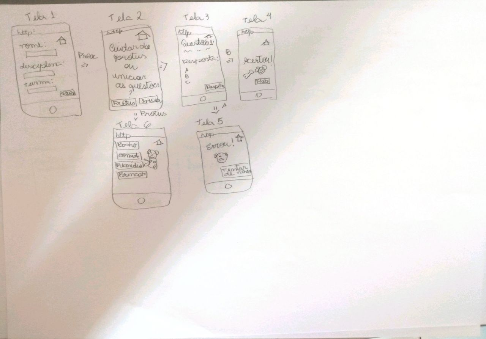
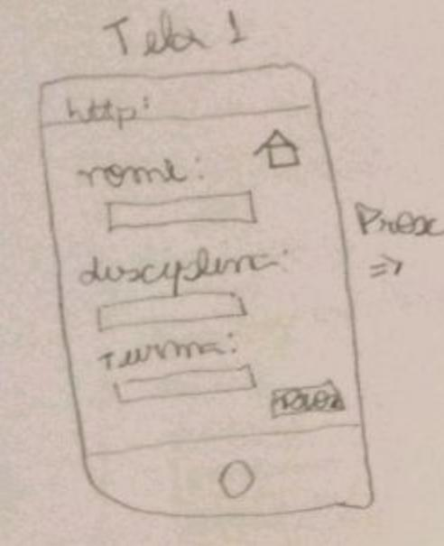
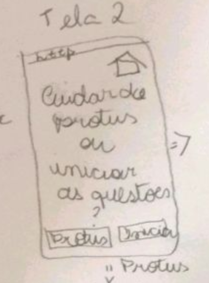
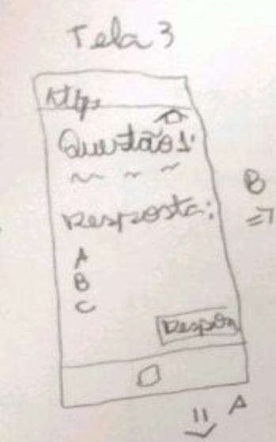
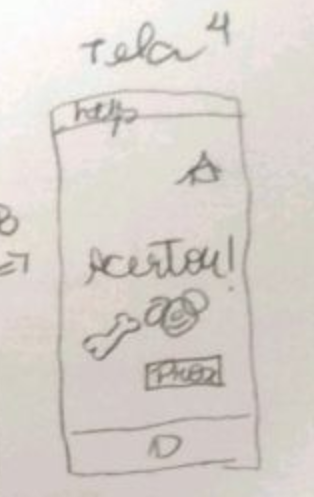
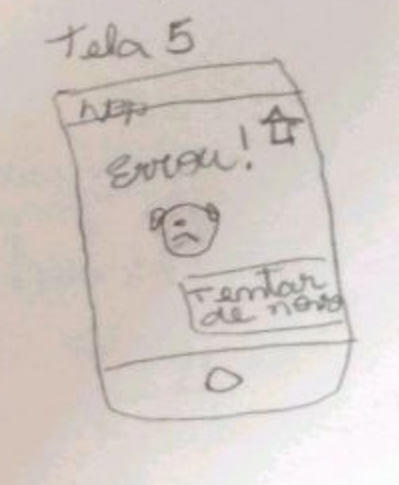
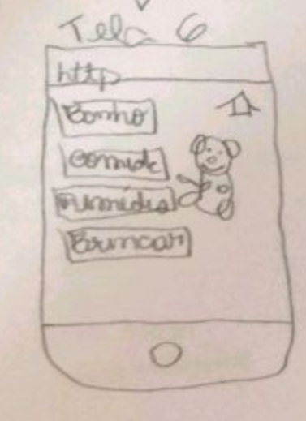

# Análise dos Resultados do Protótipo de Papel

Data | Versão | Descrição | Autor(es)
---- | ---- | ----| -----
18/09/2020 | 0.0 | Criação do Protótipo de Papel | Gabriela
20/09/2020 | 0.1 | Criação do documento | Stéfane Souza
20/09/2020 | 0.2 | Descrição da Análise do Resultado | Stéfane Souza
16/11/2020 | 0.3 | Separação de telas protótipo de papel | Guilherme Leal
01/12/2020 | 0.4 | Atualização e revisão do documento | Stéfane Souza

### Perfil dos Participantes

##### Tabela 1 - Perfil dos Participantes

| Nome  | Idade  | Escolaridade   | Ocupação profissional |
|---|---|---|---|
| Lucas | 25 | Ensino Superior Incompleto  | Estudante |

##### Fonte: Autor (2020)

### Protótipo de Baixa Fidelidade

##### Figura 1 - Protótipo de Baixa Fidelidade

##### Fonte: Autor (2020)

#### Obs: O teste abaixo foi utilizado como um Teste Piloto.

### Perguntas e Respostas

Nesse tópico iremos apresentar as perguntas que foram feitas para o participante e as respostas do mesmo (a elaboração das perguntas está aba 'Planejamento da Avaliação do ProtoGame'): 

- As atividades do aluno estão adequadas?

"Está sim. Tá bem legal, vocês tem recompensa, tem feedback... Talvez falte um sensação de progresso, talvez uma barra de progresso seja legal, mas está bem adequado sim." 

- As atividades do aluno estão claras?

 Faltaram informações para o usuário, como um tutorial, uma tela inicial que explica o que é o jogo e o Protus, mas foi a única coisa não vejo nada mais complexo do que isso. 

- O fluxo das atividades do aluno estão intuitivas?

"Está intuitivo, dá para entender que preciso clicar nos botões e tudo, mas isso que está bem ligado ao que falei sobre as informações que vocês poderiam trazer em tela." 

- A organização e apresentação da informação está simples de compreender?

"Tendo um tutorial, um contexto ficaria mais claro do que se trata. A parte que isso mais aconteceu foi na hora de cuidar do Protus e ir para as questões, eu não sabia o que era o Protus. De resto está tudo bem legal, o fluxo também, a posição dos botões, um comportamento bem padrão então está bom." 

- A ideia do produto é agradável?

"É sim."

- O personagem Protus(bichinho de estimação) transmite uma ideia/sentimento positivo?

"Me lembra muito de quando eu jogava Tamagotchi, eu gosto muito dessas coisas então traz um sentimento positivo sim." 

- Você se sentiu frustrado em algum momento da avaliação?

 "Mais ou menos."

- Em caso afirmativo, descreva quais atividades causaram frustração.

"Se eu posso trazer algo que chegue perto de uma frustação foi quando vi que eram questões e questões por si própria, mas dependendo como isso fique em um protótipo de alta fidelidade será melhor. Fugir de uma visão de prova ou um formulário que você vai preenchendo, talvez fosse legal uma apresentação de pontos, uma animação de parabéns como acertar a questão, esse tipo de coisa talvez anime mais o usuário." 

- De modo geral, qual a sua opnião sobre o produto?

"Acho que é um produto com bastante potencial, muitas pessoas estão fazendo coisas semelhantes para ensino. Então, se for bem executado pensando no contexto do público-alvo, tendo gamificação no jogo eu acho que tem tudo para dar certo." 

### Análise

As informações foram coletadas atráves de um teste e entrevista com um aluno do curso de Engenharia de Software que já cursou a matéria de Interação Humano-Computador, o que se enquadra dentro das Personas definidas para esse projeto. 

Esse teste foi de muita importância para o projeto. O participante está fazendo o TCC na área de jogos educacionais e mesmo com um projeto de papel um pouco simples do nosso projeto nóscolhemos informações que vão deixar nosso jogo bem melhor. Ficou claro a importância de contextualizar o usuário através de um tutorial para que ele entenda o objetivo do jogo, assim como elementos para jogo ser mais atrativo, intuitivo e estimular a curiosidade do usuário ao jogar por meio de gamificação e telas visualmente agradáveis. O projeto foi elogiado pela sua ideia. 

### Vídeo da Entrevista (Teste Piloto)

- [Teste do Protótipo de Papel](https://drive.google.com/file/d/14mh8qNwRrwmbN4OJMRXY1uAPODFYbmPw/view?usp=sharing)

- [Perguntas e Respostas](https://drive.google.com/file/d/15jJGiMmnHCzwWHNLceM6D7lRSFhdLerh/view?usp=sharing)

### Telas Individuais

##### Figura 2 - Tela 1 do Protótipo de Baixa Fidelidade

##### Fonte: Autor (2020)
_____

##### Figura 3 - Tela 2 do Protótipo de Baixa Fidelidade

##### Fonte: Autor (2020)
______

##### Figura 4 - Tela 3 do Protótipo de Baixa Fidelidade

##### Fonte: Autor (2020)
______

##### Figura 5 - Tela 4 do Protótipo de Baixa Fidelidade

##### Fonte: Autor (2020)
______

##### Figura 6 - Tela 5 do Protótipo de Baixa Fidelidade

##### Fonte: Autor (2020)
______

##### Figura 7 - Tela 6 do Protótipo de Baixa Fidelidade

##### Fonte: Autor (2020)

## Referências

> Protótipo de Baixa Fidelidade por Gabriela
