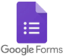
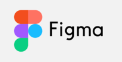

# Ferramentas

Data | Versão | Descrição | Autor(es)
---- | ---- | ----| -----
04/10/2020 | 0.0 | Criação do Documento | Gabriela
01/12/2020 | 0.1 | Atualização e revisão do documento | Stéfane Souza

As ferramentas listadas abaixo foram utilizadas em todo processo de planejamento do jogo ProtoGame.

### Questionários e Comunicação
Foi utilizado o Google Forms para elaboração das perguntas e o Telegram e WhatsApp para sua divulgação.

##### Tabela 1 - Ferramentas: Questionários e Comunicação

| Google Forms   | Telegram   | WhatsApp   |
|---|---|---|
|   |   |   

#### Fonte: Autor (2020)

### Prototipação
Foi utilizado o Figma para elaboração do Protótipo de Alta Fidelidade.

##### Tabela 2 - Ferramentas: Prototipação

| Figma |
|---|
|   |

#### Fonte: Autor (2020)

### Organização da Equipe
Foram utilizados planilhas do Google, Google Drive, GitHub e GitPages.

##### Tabela 3 - Ferramentas: Organização da Equipe

| Planilhas Google  | Google Drive   | GitHub  | Git Pages |
|---|---|---|---|
|   |   |  | 

#### Fonte: Autor (2020)

### Diagramação
Foi utilizado o draw.io e Storyboard That para elaboração de fluxos, diagramas, storyboards, etc.

##### Tabela 4 - Ferramentas: Diagramação

| draw.io  | Storyboard That | 
|---|---|
|   | 

#### Fonte: Autor (2020)