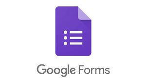
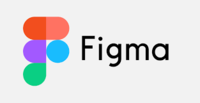
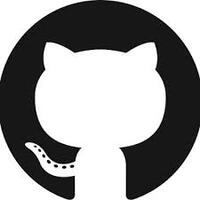

# Ferramentas
As ferramentas listadas abaixo foram utilizadas em todo processo de planejamento do jogo ProtoGame.

###Questionários
Foi utilizado o Google Forms para elaboração das perguntas e o Telegram e WhatsApp para sua divulgação

###Prototipação
Foi utilizado o Figma

###Organização da Equipe
Foram utilizados planilhas do Google, Google Drive e Github

###Diagramação
Foi utilizado o draw.io

