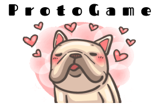

# ProtoGame

O ProtoGame que tem como objetivo ajudar pessoas interessadas em Prototipação e alunos da matéria de Interação Humano-Computador, fazemos isso por meio de um site onde o jogo foi planejado para ser desenvolvido, podendo ser jogado em dispositivos móveis ou computador. É um jogo educacional onde o usuário pode aprender ou treinar seus conhecimentos em Prototipação enquanto ajuda o Protus, nosso mascote. A idealização do jogo foi feita para a disciplina de Seminários em Engenharia de Software da Universidade de Brasília Campus Gama (FGA).

Conheça mais sobre o nosso jogo e seu planejamento navegando pelo menu lateral. Veja nosso prótotipo de alta fidelidade e avaliações com as Personas, <a href=https://design-de-jogos.github.io/2020.1-ProtoGame/Avaliacao-relato-resultados-proto-alta-fidelidade/>clicando aqui</a>.
