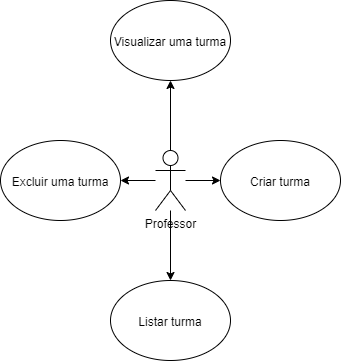
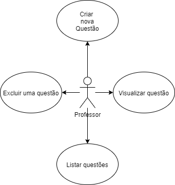
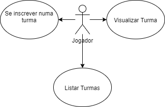
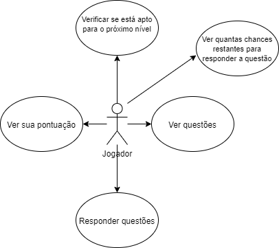
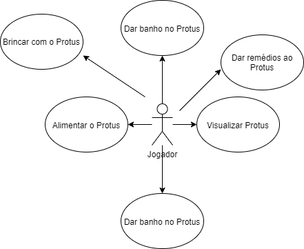
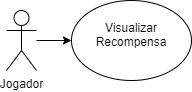

# Recursos do Produto

Data | Versão | Descrição | Autor(es)
---- | ---- | ----| -----
04/10/2020 | 0.0 | Criação do Documento | Gabriela
01/12/2020 | 0.1 | Revisão do documento | Stéfane Souza

O jogo possui as seguintes funcionalidades:

* Criar uma turma
* Criar ambiente de questões
* Entrar em uma turma
* Iniciar o jogo
* Mudar de nível
* Interação com o Protus
* Recompensas

 Cada uma dessas funcionalidades são descritas por histórias de usuário contemplando o necessário para o desenvolvimento da funcionalidade como um todo. A seguir, temos casos de uso para cada funcionalidade a ser desenvolvida: 

### Criar Turma

Essa funcionalidade será desenvolvida apenas para um usuário com perfil de professor.

##### Figura 1 - Funcionalidade: Criar Turma

### Criar Ambiente de Questões

Essa funcionalidade será desenvolvida apenas para um usuário com perfil de professor.

##### Figura 2 - Funcionalidade: Criar Ambiente de Questões

### Entrar em uma Turma

Essa funcionalidade será desenvolvida para um usuário com perfil de estudante.

##### Figura 3 - Funcionalidade: Entrar em uma Turma

### Iniciar Jogo

Essa funcionalidade será desenvolvida para um usuário com perfil de estudante ou jogador.

##### Figura 4 - Funcionalidade: Iniciar Jogo

### Mudança de Nível

Essa funcionalidade será desenvolvida para um usuário com perfil de estudante ou jogador.

##### Figura 5 - Funcionalidade: Mudança de Nível

### Interação com Protus

Essa funcionalidade será desenvolvida para um usuário com perfil de estudante ou jogador.

##### Figura 6 - Funcionalidade: Interação com Protus

### Recompensa

Essa funcionalidade será desenvolvida para um usuário com perfil de estudante ou jogador.

##### Figura 7 - Funcionalidade: Recompensa

## Referências
> Figuras 1, 2, 3, 4, 5, 6 e 7 por Gabriela

> https://app.diagrams.net/

> http://csis.pace.edu/~marchese/CS389/L9/Use%20Case%20Diagrams.pdf
