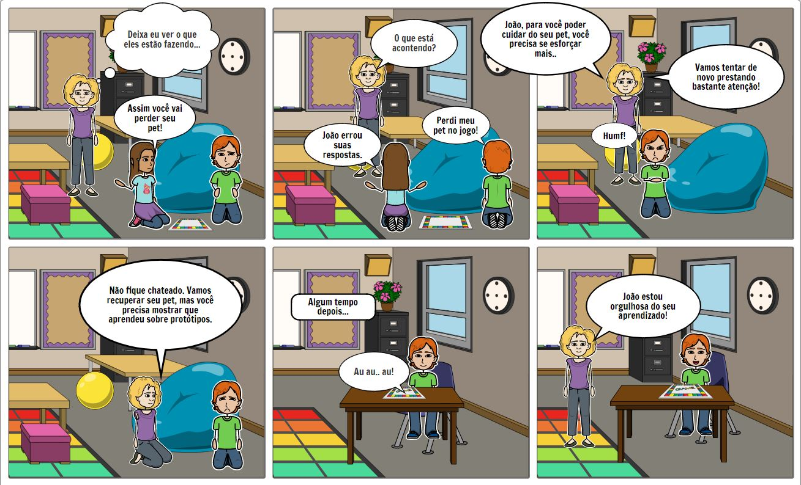

# Storyboads 

### Histórico de versão 

| Data | Versão | Descrição | Autor(es) | 
| :--: | :----: | :-------: | :-------: | 
|20/09/2020| 0.1 | Criação do Manual de Identidade Visual| [Guilherme Leal](https://github.com/gleal17)|
01/12/2020 | 0.2 | Revisão do documento | Stéfane Souza

## Introdução 

Storyboard (também chamados Roteiros) são definidos por Preece et al(1) como sendo a representação de sequências de ações ou eventos pelas quais o usuário e o produto devem passar para executarem uma ação. Preece et al (1) afirmam ainda que há dois propósitos em utilizar-se de Storyboards: (i) para obter feedback de usuários, e (ii) para que a equipe de design considere o cenário e a utilização do produto em maiores detalhes. 
 

## 2. Storyboards 

Foram criados storyboards com características ativas e interativas, ou seja, correspondem a uma sequência de figuras que mostram uma
descrição automatizada do modo como o sistema se comporta em um uso típico ou
em um cenário, por exemplo, uma simulação de possíveis utilações do aplicativo e de forma que o usuário deva participar interagindo com o sistema.

##### Figura 1 - Storyboard 1

##### Fonte: Autor (2020)

##### Figura 2 - Storyboard 2

##### Fonte: Autor (2020)

##### Figura 3 - Storyboard 3

##### Fonte: Autor (2020)

##### Figura 4 - Storyboard 4

##### Fonte: Autor (2020)

##### Figura 5 - Storyboard 5

##### Fonte: Autor (2020)

##### Figura 6 - Storyboard 6

##### Fonte: Autor (2020) 

## Referências 

> (1) PREECE, J.; Rogers, Y.; Sharp, H. (2013). Design de Interação: além da interação humano-computador. Tradução: Isabela Gasparini; revisão técnica: Marcelo Soares Pimenta - 3. Ed – Porto alegre: Bookman, 2013 

> Storyboard 1 por Guilherme Leal (edição adaptada) em https://www.storyboardthat.com/

> Storyboards 1, 2, 3, 4, 5 e 6 por Guilherme Leal
